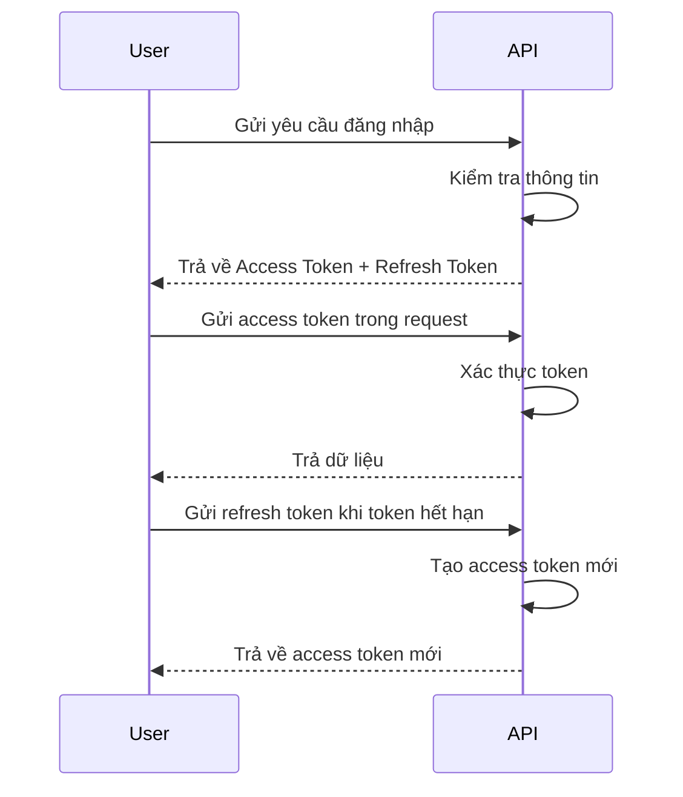

# 🛒 SalesManagement API

**SalesManagement** là hệ thống quản lý bán hàng xây dựng bằng **.NET 8**, hỗ trợ xác thực người dùng, phân quyền theo vai trò, bảo mật cao, ghi log hệ thống và quản lý phiên người dùng với NHibernate.

---

## 🚀 Tính Năng Chính

- ✅ Xác thực người dùng bằng **JWT**
- ✅ Phân quyền theo **vai trò và quyền hạn**
- ✅ Mã hóa mật khẩu bằng **BCrypt**
- ✅ Quản lý phiên làm việc với **NHibernate**
- ✅ Làm mới access token bằng **refresh token**
- ✅ Ghi log chi tiết với **log4net**

---

## 🛠️ Công Nghệ Sử Dụng

| Công Nghệ                           | Phiên Bản     |
|------------------------------------|---------------|
| [.NET](https://dotnet.microsoft.com/) | 8.0         |
| [NHibernate](https://nhibernate.info/) | 5.5.2       |
| [SQL Server](https://www.microsoft.com/sql-server) | -       |
| [JWT Authentication](https://jwt.io/) | -           |
| [BCrypt.Net](https://github.com/BcryptNet/bcrypt.net) | - |
| [Swagger / OpenAPI](https://swagger.io/) | -         |
| [log4net](https://logging.apache.org/log4net/) | -       |

---

## 🗂️ Cấu Trúc Dự Án

```
SalesManagement/
├── SalesManagement.Api/         # API endpoints & controllers
├── SalesManagement.Business/    # Xử lý logic nghiệp vụ
├── SalesManagement.Common/      # Models & utilities dùng chung
├── SalesManagement.Entities/    # Các entity tương ứng database
└── SalesManagement.Nhibernate/  # Truy cập dữ liệu với NHibernate
```

---

## 🔐 Xác Thực & Phân Quyền

### 📌 Endpoint xác thực

- `POST /api/auth/signup` – Đăng ký
- `POST /api/auth/signin` – Đăng nhập
- `POST /api/auth/renew-token` – Làm mới token
- `POST /api/auth/signout` – Đăng xuất

### 📌 Phân quyền

- Xác thực token JWT trên mọi request
- Kiểm soát truy cập theo **Role** và **Permission**
- Tự động khóa tài khoản sau nhiều lần đăng nhập sai
- Quản lý quan hệ: **User – Role – Permission**

---

## 👤 Quản Lý Người Dùng

- CRUD người dùng
- Gán và quản lý vai trò
- Gán và quản lý quyền hạn
- Theo dõi phiên đăng nhập và trạng thái tài khoản

---

## 📘 Quy Trình Xác Thực



---

## ⚙️ Cấu Hình

| File               | Mục đích                             |
|--------------------|--------------------------------------|
| `appsettings.json` | Cấu hình JWT, logging, các options   |
| `hibernate.cfg.xml`| Cấu hình NHibernate & connection DB |
| `log4net.config`   | Cấu hình ghi log                     |

---

## 🧪 Khởi Động Dự Án

```bash
# 1. Clone repository
git clone https://github.com/Thuan3101/SalesManagement.git
cd SalesManagement

# 2. Cập nhật chuỗi kết nối trong hibernate.cfg.xml

# 3. Chạy migration (nếu có)

# 4. Build & chạy dự án
dotnet build
dotnet run --project SalesManagement.Api

# 5. Truy cập Swagger UI
http://localhost:{port}/swagger
```

---

## 📦 Dependencies Chính

- `BCrypt.Net-Next`
- `Microsoft.AspNetCore.Authentication.JwtBearer`
- `NHibernate`
- `Swashbuckle.AspNetCore`
- `Microsoft.Extensions.Logging.Log4Net.AspNetCore`

---

## 📂 API Docs – Swagger

> Tài liệu API tự động tạo sẵn tại:
```
/swagger
```

Bạn có thể dùng Postman hoặc Swagger UI để test các endpoint xác thực, quản lý người dùng, và phân quyền.

---

## 🤝 Đóng Góp

Chúng tôi luôn hoan nghênh đóng góp từ cộng đồng! ✨

1. Fork repository
2. Tạo nhánh mới `feature/<ten-tinh-nang>`
3. Commit & push thay đổi
4. Tạo Pull Request để được review

---

## 📄 Giấy Phép


---

## 📧 Liên Hệ

- 📮 Email: ngominhnhut6808@gmail.com
- 📌 Issue Tracker: Dùng tab [Issues](https://github.com/Thuan3101/SalesManagement/issues)

---
